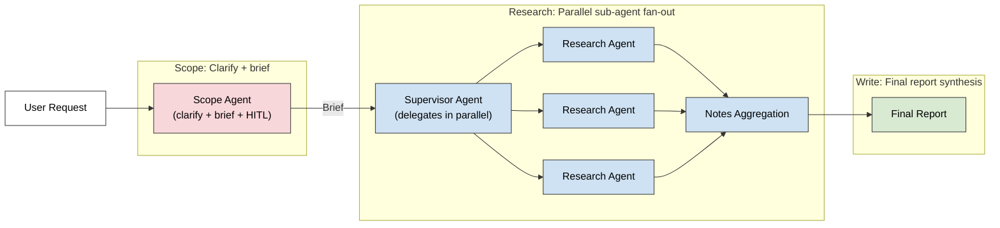
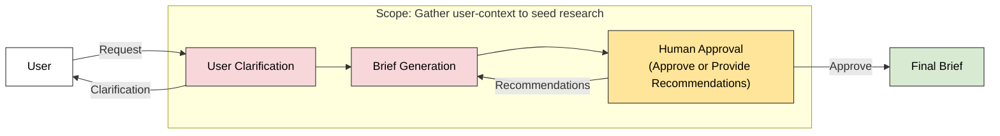
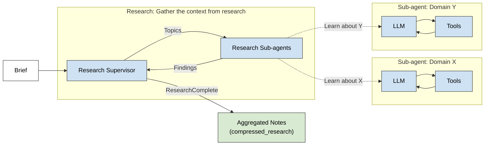
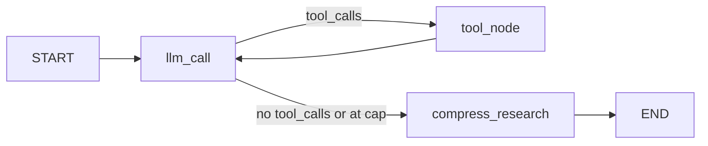
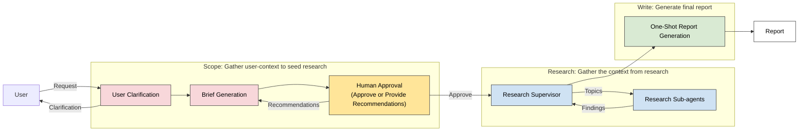
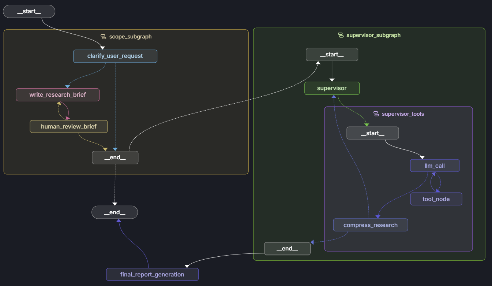

# Deep Research Agent

A multi-agent research system built on LangGraph. A scoping agent clarifies the user's request and writes a structured brief, a supervisor delegates parallel sub-research across topics, and a final report agent synthesises the findings. Five compiled graphs cover the individual phases plus the full end-to-end pipeline; each is mirrored by a sibling notebook for the conceptual walkthrough.

> Each notebook also covers LangSmith Evaluation component (like hallucination assessment, decision-making route checks, etc.)

<details>
<summary>Prerequisites</summary>

- Python 3.13
- `pip install -U langgraph-cli langchain-anthropic langchain-mcp-adapters tavily-python trustcall`
- Node.js + `npx` (only required for the `agent_mcp` graph in [3 - Research Agent with MCP](#3---research-agent-with-mcp))

`.env` must contain:
```bash
ANTHROPIC_API_KEY=sk-ant-...
TAVILY_API_KEY=tvly-...
LANGSMITH_API_KEY="lsv2_pt_..." # Optional
LANGSMITH_TRACING=true # Optional
LANGSMITH_PROJECT="deep-research-agent" # optional
```
> LangSmith keys are optional and live in the [LangGraph Studio deployment](#langgraph-studio-deployment) section below.
</details>

Composition map - how the primitives plug together in [5 - Full Multi-Agent Deep Researcher](#5---full-multi-agent-deep-researcher):



---

### 1 - Scope Agent

> Type: Structured-output routing + dynamic interrupt for HITL approval

Clarify ambiguous user requests, write a structured `ResearchBrief`, then pause for a human reviewer to approve or send revision feedback before any research runs.



<details>
<summary>Details</summary>

- **User Clarification** - forces the model to emit a typed `need_clarification: bool` based on initial analysis results. A conditional flow asks user for clarification on their request.
- **Human Approval** - Human can send approval, or provide feedback to tweak the research brief.
- **Public vs internal schema** - `StateGraph(AgentState, input_schema=AgentInputState)` exposes only `messages` to callers, keeping Studio's input panel clean. Internal state carries `research_brief`, `reviewer_feedback`, `supervisor_messages`, `notes`, `final_report`.
- **LangSmith evals** - notebook runs two LLM-as-judge evals over a synthetic dataset: a success-criteria eval (does the brief capture every requirement the user mentioned?) and a hallucination eval (does the brief invent constraints the user never stated?).

**Core pattern - `Command` routing on structured output:**

```python
def clarify_user_request(state: AgentState) -> Command[Literal["write_research_brief", "__end__"]]:
    response = model.with_structured_output(ClarifyUserRequest).invoke(...)
    if response.need_clarification:
        return Command(goto=END, update={"messages": [AIMessage(content=response.question_to_user)]})
    return Command(goto="write_research_brief", update={"messages": [AIMessage(content=response.verification)]})
```

**Core pattern - dynamic interrupt resume contract:**

```python
review = interrupt({"type": "brief_review", "research_brief": state["research_brief"], ...})
if review.get("approved"):
    return Command(goto=END)
return Command(goto="write_research_brief", update={"reviewer_feedback": review.get("feedback")})
```

</details>

---

### 2 - Research Agent

> Type: ReAct loop with tool-budget cap and post-loop compression

Iterative web-search loop using Tavily and a `think_tool` reflection primitive, with a hard tool-call budget and a context-compression node that synthesises raw findings into a clean handoff payload.



<details>
<summary>Details</summary>

- **Two-tool ReAct surface** - `tavily_search` for retrieval, `think_tool` for reflection. Reflection is modelled as a tool call so it shows up in the trace next to search results, not buried in a system message.
- **Tool-budget cap (`MAX_TOOL_ITERATIONS=3`)** - enforced inside `llm_call`, not in the conditional edge. At the cap, the unbound model (no tools attached) is invoked with a budget-exhausted nudge so it emits a final synthesis.
- **Per-tool observation cap (`MAX_OBS_CHARS=30000`)** - each `ToolMessage.content` is truncated so accumulated `researcher_messages` cannot exceed the 200k context window across budgeted iterations.
- **`compress_research` post-loop** - a separate model with `max_tokens=32000` summarises the entire `researcher_messages` history. Emits `compressed_research` (clean handoff) and `raw_notes` (full dump for downstream auditing).
- **Output-schema compile** - `StateGraph(ResearcherState, output_schema=ResearcherOutputState)` filters caller-facing keys to `{compressed_research, raw_notes, researcher_messages}`, hiding the iteration counter and tool scratchpad.



**Core pattern - cap enforced inside `llm_call`, not the edge:**

```python
def llm_call(state: ResearcherState):
    at_cap = state.get("tool_call_iterations", 0) >= MAX_TOOL_ITERATIONS
    chosen_model = model if at_cap else model_with_tools  # unbound -> forces synthesis
    return {"researcher_messages": [chosen_model.invoke([SystemMessage(...)] + state["researcher_messages"])]}

def should_continue(state: ResearcherState) -> Literal["tool_node", "compress_research"]:
    return "tool_node" if state["researcher_messages"][-1].tool_calls else "compress_research"
```

</details>

---

### 3 - Research Agent with MCP

> Type: Standalone MCP integration example - a drop-in alternative option

Same ReAct loop as notebook 2, but the toolset comes from a Model Context Protocol filesystem server scoped to a local directory instead of Tavily web search. **Standalone teaching example - intentionally not wired** into the final full agent setup, which keeps Tavily for end-to-end web research.

<details>
<summary>Details</summary>

**Reuses topology from [2 - Research Agent](#2---research-agent)** - `START -> llm_call <-> tool_node -> compress_research -> END`. The graph wiring is identical; only the tool source and the async semantics change.

**New here:**

- **`MultiServerMCPClient` over stdio** - `mcp_config` declares `command="npx"` + `args=["-y", "@modelcontextprotocol/server-filesystem", str(current_dir() / "files")]`. The filesystem server runs as a managed subprocess scoped to one directory (sandboxed read/write surface).
- **Lazy client init** - `get_mcp_client()` and `_get_mcp_tools()` defer the subprocess spawn until the first node call. Required for LangGraph Platform: the import-time module body must not start subprocesses. Also caches the tool list since the schema is static for the session.
- **Async throughout** - both `llm_call` and `tool_node` are `async def`. The model is invoked via `ainvoke`, MCP tools via `await tool.ainvoke(...)`. Forced by MCP's async-stdio transport to the subprocess.
- **Mixed sync / async dispatch** - `think_tool` is a sync LangChain tool, MCP tools are async. The dispatcher branches on `tool_call["name"] == "think_tool"` to pick between `tool.invoke(...)` and `await tool.ainvoke(...)`.

**Core pattern - lazy MCP client + cached tool list:**

```python
mcp_config = {"filesystem": {"command": "npx", "args": ["-y", "@modelcontextprotocol/server-filesystem", str(current_dir() / "files")], "transport": "stdio"}}

_client = None
_mcp_tools_cache = None

async def _get_mcp_tools():
    global _mcp_tools_cache
    if _mcp_tools_cache is None:
        _mcp_tools_cache = await get_mcp_client().get_tools()
    return _mcp_tools_cache

async def llm_call(state):
    tools = await _get_mcp_tools() + [think_tool]
    return {"researcher_messages": [await model.bind_tools(tools).ainvoke(...)]}
```

</details>

---

### 4 - Supervisor Agent

> Type: Tool-based supervisor with parallel async fan-out

Lead supervisor delegates research tasks to multiple research sub-agents in parallel via `asyncio.gather`, then aggregates each sub-agent's `compressed_research` from `ToolMessage` content into the running `notes` list.


<details>
<summary>Details</summary>

- **Tools as decisions** - `ConductResearch` (delegate one sub-research task) and `ResearchComplete` (declare done) are Pydantic schemas bound as tools to the supervisor model. The supervisor's "decision" is whichever tool it calls.
- **Sync + async tools in one turn** - the supervisor can emit `think_tool` (sync), `ConductResearch` (async sub-agent), and `ResearchComplete` (terminal sentinel) in the same response. `supervisor_tools` partitions calls by name, runs the sync batch first, then _awaits_ the async batch.
- **Parallel sub-agent fan-out** - one `researcher_agent.ainvoke(...)` per `ConductResearch` call, all awaited via `asyncio.gather(*researcher_invokations)`. `max_concurrent_researchers=2` is enforced through the supervisor prompt (the model is told to emit at most N `ConductResearch` calls per turn).
- **Results as `ToolMessage`s** - each sub-agent's `compressed_research` is wrapped as `ToolMessage.content` with the matching `tool_call_id`. `get_notes_from_tool_calls(supervisor_messages)` later filters `tool` messages and pulls the strings. This is how findings flow back into supervisor state without a custom reducer.
- **Three exit conditions** - `research_iterations >= max_research_iterations=3`, no tool calls on the supervisor's last turn, or any `ResearchComplete` call. All route to `END`(of this sub-graph in full-agent setup); otherwise loop back to `supervisor`.
- **`raw_notes` accumulation** - declared as `Annotated[list, operator.add]` on `SupervisorState` so per-iteration batches concatenate instead of overwrite.

**Core pattern - parallel fan-out + ToolMessage aggregation:**

```python
researcher_invokations = [
    researcher_agent.ainvoke({
        "researcher_messages": [HumanMessage(content=tc["args"]["research_topic"])],
        "research_topic": tc["args"]["research_topic"],
    })
    for tc in conduct_research_calls
]
tool_results = await asyncio.gather(*researcher_invokations)

research_tool_messages = [
    ToolMessage(content=r.get("compressed_research", ""), name=tc["name"], tool_call_id=tc["id"])
    for r, tc in zip(tool_results, conduct_research_calls)
]
```

</details>

---

### 5 - Full Multi-Agent Deep Researcher

> Type: End-to-end pipeline composing scope + supervisor as subgraphs

Embeds both Scope agent & Supervisor agent as compiled subgraphs inside a parent graph, plus a final `generate_final_report` node. The scope subgraph's HITL interrupt propagates up through the parent's checkpointer transparently.



<details>
<summary>Details</summary>

- **Subgraph-as-node composition** - "scope_subgraph" & "supervisor_subgraph" agents plug the compiled child graphs in directly. The parent's `AgentState` is a superset of both child states, so shared keys (`messages`, `research_brief`, `supervisor_messages`, `notes`) flow across boundaries with no transform layer.
- **`route_after_scope` conditional edge** - the scope subgraph terminates two ways: clarification asked (no brief) or HITL approved (brief set). Reading `state.get("research_brief")` decides whether to run `supervisor_subgraph` or end the parent run. A clarify-and-wait turn returns control to the caller without firing research.
- **Interrupt propagation across boundaries** - the scope subgraph's `interrupt()` surfaces in the parent's checkpoint as a `tasks[0].interrupts[0]` payload. The caller resumes via the parent's config (`Command(resume={"approved": True})`); the resume routes back into the subgraph's paused node automatically.
- **Async final node** - `generate_final_report` uses `research_brief` + joined `notes` into `final_report`.
- **`recursion_limit=50`** - bumped from the default 25 (set by LangGraph) to fit the complex research loop/jump requirements.

**Core pattern - subgraph composition + conditional routing on shared state:**

```python
def route_after_scope(state: AgentState) -> Literal["supervisor_subgraph", "__end__"]:
    return "supervisor_subgraph" if state.get("research_brief") else END

builder = StateGraph(AgentState, input_schema=AgentInputState)
builder.add_node("scope_subgraph", scope_research_agent)        # compiled subgraph
builder.add_node("supervisor_subgraph", supervisor_agent)       # compiled subgraph
builder.add_node("final_report_generation", generate_final_report)
builder.add_edge(START, "scope_subgraph")
builder.add_conditional_edges("scope_subgraph", route_after_scope, ["supervisor_subgraph", END])
builder.add_edge("supervisor_subgraph", "final_report_generation")
builder.add_edge("final_report_generation", END)
```

</details>

---

### Artifact flow

How state moves between the three agents in the [full pipeline](#5---full-multi-agent-deep-researcher):

| Field | Produced by | Consumed by | Shape |
|---|---|---|---|
| `research_brief` | [Scope Agent](#1---scope-agent) `write_research_brief` | [Supervisor Agent](#4---supervisor-agent) `supervisor` (system prompt context) + final report node | `str` |
| `supervisor_messages` | [Scope](#1---scope-agent) seeds with the brief; [Supervisor](#4---supervisor-agent) extends per turn | Used internally by supervisor; aggregated for `notes` extraction at exit | `list[BaseMessage]` |
| `compressed_research` | Each [Research Agent](#2---research-agent) sub-invocation | [Supervisor](#4---supervisor-agent) `supervisor_tools` wraps as `ToolMessage.content` | `str` |
| `notes` | [Supervisor](#4---supervisor-agent) `get_notes_from_tool_calls(supervisor_messages)` at exit | `generate_final_report` joins with newlines into the prompt's `findings` slot | `list[str]` |
| `final_report` | `generate_final_report` | Caller (returned in parent state) | `str` |

---

## LangGraph Studio deployment

The Python files in `src/` are the deployable artefacts behind the notebooks. `langgraph.json` exposes five graph entry points; `langgraph dev` boots them on `127.0.0.1:2024` for [LangGraph Studio](https://studio.langchain.com/) inspection.



### LangSmith Tracing & Studio

LangSmith powers the Studio UI and the trace viewer. Skip this section if you're only invoking graphs via the SDK or CLI.

> Checkout LangSmith Tracing [here](https://smith.langchain.com/public/e565d786-2b69-49b2-a36b-5ef3cf6b7844/r).

<details>
<summary>Show details</summary>

Add to `.env`:

```bash
LANGSMITH_API_KEY=lsv2_pt_...
LANGSMITH_TRACING=true
LANGSMITH_PROJECT=deep-research-agent
```

After `langgraph dev` boots, connect Studio at:

`https://smith.langchain.com/studio/?baseUrl=http://127.0.0.1:2024`

Note: the Lite control plane requires `LANGSMITH_API_KEY` even when `LANGSMITH_TRACING=false` (see project `CLAUDE.md`).

</details>

### Run `langgraph dev`

Boots a local LangGraph server on `127.0.0.1:2024` exposing all five graphs.

<details>
<summary>Show details</summary>

```bash
cd 100_Agents/1_Deep_Research_Agent
langgraph dev
```

The CLI watches `src/` and hot-reloads on save. Stop with `Ctrl+C`.

</details>

### Graphs exposed

Five graphs: scoping, single researcher, MCP-backed researcher, multi-agent supervisor, and the full end-to-end pipeline.

<details>
<summary>Show details</summary>

| `graph_id` | Source | Notebook | What it does |
|---|---|---|---|
| `section_scope_research_agent` | [src/research_agent_scope.py](src/research_agent_scope.py) | [1_Scope_Agent.ipynb](1_Scope_Agent.ipynb) | Clarify the user request, write a structured `ResearchBrief`, gate on a human-in-the-loop `interrupt()` review. |
| `section_researcher_agent` | [src/research_agent.py](src/research_agent.py) | [2_Research_Agent.ipynb](2_Research_Agent.ipynb) | Iterative ReAct loop with `tavily_search` + `think_tool`; compresses findings into `compressed_research`. |
| `section_agent_mcp` | [src/research_agent_mcp.py](src/research_agent_mcp.py) | [3_Research_Agent_with_MCP.ipynb](3_Research_Agent_with_MCP.ipynb) | Same loop as `researcher_agent`, but tools come from the MCP filesystem server scoped to `src/files/`. |
| `section_supervisor_agent` | [src/multi_agent_supervisor.py](src/multi_agent_supervisor.py) | [4_Supervisor_Agent.ipynb](4_Supervisor_Agent.ipynb) | Lead supervisor delegates to parallel researcher sub-agents via `asyncio.gather`, aggregates `notes`. |
| `full_deep_researcher_agent` | [src/research_agent_full.py](src/research_agent_full.py) | [100_MultiAgent_Deep_Researcher_Full.ipynb](100_MultiAgent_Deep_Researcher_Full.ipynb) | End-to-end pipeline: scope subgraph -> human review -> supervisor subgraph -> final report. |

</details>

### Sample inputs per graph

One runnable input each, copy-paste into Studio's Input panel.

<details>
<summary>Show details</summary>

**`section_scope_research_agent`** (input schema: `AgentInputState`, key `messages`):

**Turn 1 - vague request, clarify branch:**

```json
{ "messages": [{ "role": "user", "content": "Agentic AI best practices" }] }
```

`clarify_user_request` decides `need_clarification=True`, appends an `AIMessage` with a clarification question, and routes to `END`. The graph terminates without writing a brief.

**Turn 2 - reply on the same thread:**

In Studio, keep the same thread open and submit the user's answer as the next turn. The `add_messages` reducer appends it to the existing message history; `clarify_user_request` re-runs against the full conversation:

```json
{ "messages": [{ "role": "user", "content": "Production deployments. Focus on observability, evals, and guardrails for tool-using agents in regulated industries." }] }
```

This time `need_clarification=False`, control flows to `write_research_brief` -> `human_review_brief`, and the graph pauses on the interrupt.

**Turn 3 - resume the interrupt:**

```json
{ "approved": true }
```

Or reject with feedback to loop back into `write_research_brief` in revise mode:

```json
{ "approved": false, "feedback": "Tighten scope to evaluation harnesses only; drop guardrails." }
```

---

**`section_researcher_agent`** (input schema: `ResearcherState`, keys `researcher_messages` + `research_topic`):

```json
{
  "researcher_messages": [
    { "role": "user", "content": "Research production best practices for agentic AI: observability, evals, guardrails." }
  ],
  "research_topic": "Production best practices for agentic AI: observability, evals, guardrails"
}
```

Expect Tavily search calls and a `compressed_research` field on the output.

---

**`section_agent_mcp`** (same schema as `section_researcher_agent`; requires `src/files/` populated with at least one document):

```json
{
  "researcher_messages": [
    { "role": "user", "content": "Summarise the documents under src/files/." }
  ],
  "research_topic": "Local research notes summary"
}
```

---

**`section_supervisor_agent`** (input schema: `SupervisorState`, key `supervisor_messages`):

```json
{
  "supervisor_messages": [
    { "role": "user", "content": "I'm researching system design and architecture for production agentic AI: state, orchestration, evals." }
  ]
}
```

Watch for parallel researcher sub-agents firing via `asyncio.gather`.

---

**`full_deep_researcher_agent`** (input schema: `AgentInputState`, key `messages`; full pipeline with HITL gate):

This graph embeds `section_scope_research_agent` as a subgraph at the start, so the same multi-turn clarification flow applies before any research runs.

**Turn 1 - vague kickoff, clarify branch terminates the run:**

```json
{ "messages": [{ "role": "user", "content": "I want to learn about AI agents." }] }
```

The scope subgraph asks a clarification question and the parent graph's `route_after_scope` sees no `research_brief`, so it routes to `END`.

**Turn 2 - reply on the same thread:**

```json
{ "messages": [{ "role": "user", "content": "Specifically, security best practices: prompt-injection defenses, tool sandboxing, and least-privilege credential handling for production agents." }] }
```

`clarify_user_request` re-runs, accepts the brief, and the graph pauses at `human_review_brief` inside the subgraph.

**Turn 3 - resume the interrupt:**

```json
{ "approved": true }
```

or reject with feedback (loops back to `write_research_brief` in revise mode):

```json
{ "approved": false, "feedback": "Focus only on prompt-injection defenses; drop the credential section." }
```

After approval, control returns to the parent graph: `supervisor_subgraph` fans out research, then `final_report_generation` writes the report into `final_report`.

**Skip-clarification shortcut:** if Turn 1 is detailed enough, `clarify_user_request` returns `need_clarification=False` immediately, the run goes straight to `human_review_brief`, and Turn 2 is the resume payload.

```json
{ "messages": [{ "role": "user", "content": "Research security best practices for production AI agents: prompt-injection defenses, tool-use sandboxing, and credential handling." }] }
```

</details>

---

## Reference

- [LangChain Deep Research Agent](https://github.com/langchain-ai/open_deep_research)